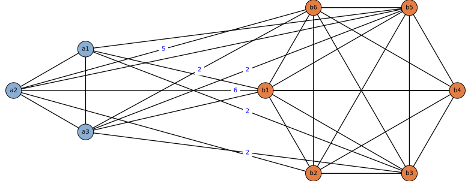

# epi-chain-gillespie
This repository contains an implementation of Gillespie algorithm located under `src/gillespie_sim.py` for simulation of SIR-type epidemics on contact networks, with support for:

- weighted graphs (weights are interpreted as repeated contacts)

- two-type vertex dynamics (e.g. groups of vertices A and B)

- infection-chain tracing (recording parent infector for each infection event)

- event-level output (time, event type, selected vertex, parent, states)


## TODOs:
- extend to compartmental model: `S, E, I_pre, I_asym, I_sym, R`
- add detection book-keeping class `D`

## UPDATES:
- removed local updates and switched to global updates
- this makes it run slower, but makes it easier to implement extensions


## Example
Load the example contact network
```python
from src.contact_networks import example_contact_network
from src.gillespie_sim import gillespie_sim, get_node_order

graph_g = example_contact_network()

print(get_node_order(graph_g))
# ['a1', 'a2', 'a3', 'b1', 'b2', 'b3', 'b4', 'b5', 'b6']
```

The example graph shown below has a partition into two groups (vertex types) `A` and `B`, with weighted edges between the groups. Edges with weight 1 are drawn without labels to reduce clutter:




Run Gillespie simulation (SIR):
```python
model_params = {
    "beta": 2.0,
    "mu": 1.0,
}

time_max = 5
rng = np.random.default_rng(12345)
n_init_infected = 2

out = gillespie_sim(
    graph_g = graph_g,
    model_params=model_params,
    time_max=time_max,
    rng=rng,
    n_init_infected=n_init_infected)
```

The output is a dictionary with:

- times
- counts
- events
- node_order
- init (initially infected sampled from group A)
- graph (final graph state)

Example output:
```python
out['init']
# {'initial_infected_nodes': [np.str_('a2'), np.str_('a1')]}

out["node_order"]
# ['a1', 'a2', 'a3', 'b1', 'b2', 'b3', 'b4', 'b5', 'b6']

out['events'][:5]
# [{'t': np.float64(0.039908780120589134),
#   'event_type': 'infection',
#   'node': 'b5',
#   'parent': 'a1',
#   'states': ['I', 'I', 'S', 'S', 'S', 'S', 'S', 'I', 'S']},
#  {'t': np.float64(0.04784380567460845),
#   'event_type': 'infection',
#   'node': 'b4',
#   'parent': 'a2',
#   'states': ['I', 'I', 'S', 'S', 'S', 'S', 'I', 'I', 'S']},
#  {'t': np.float64(0.07212748705434137),
#   'event_type': 'infection',
#   'node': 'b6',
#   'parent': 'a2',
#   'states': ['I', 'I', 'S', 'S', 'S', 'S', 'I', 'I', 'I']},
#  {'t': np.float64(0.1412810219640478),
#   'event_type': 'infection',
#   'node': 'b2',
#   'parent': 'a2',
#   'states': ['I', 'I', 'S', 'S', 'I', 'S', 'I', 'I', 'I']},
#  {'t': np.float64(0.15585874749547937),
#   'event_type': 'infection',
#   'node': 'b3',
#   'parent': 'b5',
#   'states': ['I', 'I', 'S', 'S', 'I', 'I', 'I', 'I', 'I']}]
```

The `parent` field records the sampled infector for an infection event, which allows infection-chain tracing.

For example, in the first event above at time `t = 0.0399`:

- `node: 'b5'` means vertex `b5` became infected 
- `parent: 'a1'` means the simulation recorded `a1` as the infector of `b5`

So this event contributes the to infection-chain an edge:

- `a1 -> b5`

Thus, each infection event adds one directed edge `parent -> node` to the infection chain, which is a tree (forest in general) rooted at the initially infected vertices (`'a1', 'a2'` in this example).


## Setup

Minimal setup (tested with Python 3.14):
```zsh
python3 -m venv .venv
source .venv/bin/activate
pip install --upgrade pip
pip install numpy networkx
```

Optional: [SageMath](https://doc.sagemath.org/html/en/installation/index.html) for drawing and exporting graphs (tested with SageMath 10.8).


## References / Links

- [Wikipedia : Gillespie algorithm](https://en.wikipedia.org/wiki/Gillespie_algorithm) stochastic simulation algorithm (SSA)

- Tutorial [arXiv 2112.05293](https://arxiv.org/abs/2112.05293): "Gillespie algorithms for stochastic multiagent dynamics in populations and networks", by Naoki Masuda, Christian L. Vestergaard, (2021): includes SIR on networks, the first reaction method, Gillespie's direct method, and discussion of computational complexity.


### Note on terminology

According to the tutorial, this repository currently implements *Gillespie's direct method* for a continuous-time Markov-chain SIR model on a contact network, with **vertex-centric events**.

The simulation step is of the form:

1. Compute total rate $\Lambda = \sum_i \lambda_i$

2. Draw waiting time $\tau \sim \mathrm{Exp}(\Lambda)$

3. Select the next event with probability $\lambda_i / \Lambda$

4. Update the state and affected rates

### Additional notes

- The treatment of two-type vertex labels and infection-chain tracing is additional bookkeeping.

- Edge weights modify infection intensities and parent-sampling probabilities.
