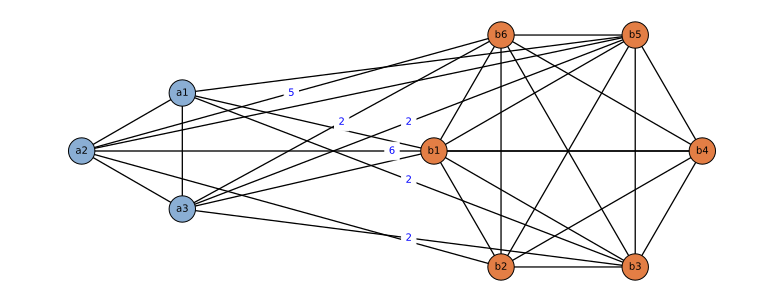

# epi-chain-gillespie

This repository contains an implementation of Gillespie's algorithm for simulating a continuous-time Markov chain epidemic model on a contact network, with:

- weighted edges, interpreted as repeated contacts

- two-type vertex dynamics, with vertex groups `A` and `B`

- infection-chain tracing, recording a parent infector on infection events

- an auxiliary detection / observation layer for simulated resident case counts

- event-level output, including event time, event type, selected vertex, parent infector, and full state snapshots


The simulation code is in [`src/gillespie_sim.py`](./src/gillespie_sim.py).

## Example

### Example contact network
Load the example contact network from [`./src/contact_networks.py`](./src/contact_networks.py):
```python
from src.contact_networks import example_contact_network

graph_g = example_contact_network()

print(get_node_order(graph_g))
# ['a1', 'a2', 'a3', 'b1', 'b2', 'b3', 'b4', 'b5', 'b6']
```

The example graph shown below has a partition into two groups (vertex types) `A` and `B`, with weighted edges between the groups. Edges with weight 1 are drawn without labels to reduce clutter:



### Example simulation

To run the simulation of staged SEIR with presymptomatic block `Ip` and the Wave 2 resident detection layer, using a fixed RNG seed:

```python
import numpy as np

from src.contact_networks import example_contact_network
from src.gillespie_sim import gillespie_sim, get_node_order

graph_g = example_contact_network()

# set disease model parameters
model_params = {
    "beta_AB": 2.0,      # transmission beta_{A, B} (= beta_{B, A})
    "beta_AA": 2.0,      # transmission beta_{A, A}
    "beta_BB": 2.0,      # transmission beta_{B, B}

    "sigma": 1.0,        # E progression rate
    "lambda_pre": 1.0,   # Ip progression rate
    "mu": 1.0,           # Ia and Is progression rate

    "K1": 2,             # number of E stages
    "K_pre": 2,          # number of I_pre stages
    "K2": 2,             # number of I_asym stages
    "K3": 2,             # number of I_sym stages

    "alpha": 0.25,       # branching at Ip:K_pre probability to go to Ia:1
}

time_max = 50.0
rng = np.random.default_rng(12345)
n_init_infected = 2

out = gillespie_sim(
    graph_g=graph_g,
    model_params=model_params,
    time_max=time_max,
    rng=rng,
    n_init_infected=n_init_infected,
    wave="wave2",
)
```

The disease model parameters describe the latent epidemic process. Detection is handled separately by the auxiliary observation layer selected by `wave`.

Currently supported detection regimes are:

- `wave="wave2"`: resident PCR-based detection, including symptom-triggered testing, routine testing, and outbreak-triggered resident testing

- `wave="omicron"`: resident LFD-based detection with lower ascertainment and no outbreak testing by default

- `wave=None`: no detection layer


### Example output

The output is a dictionary with:

- `times`: latent disease-event times, starting at `0` and ending at `time_max`
- `counts`: latent disease counts, aggregated over substages
- `events`: latent disease-event list, with `t`, `event_type`, `node`, parent`, and `states`
- `node_order`: fixed node ordering used for state snapshots
- `init`: initially infected nodes, sampled from group `A`
- `graph`: final graph state, including node attributes
- `detected`: auxiliary detected resident-case process     **<--- NEW**

Example:

```python
out["init"]
# {'initial_infected_nodes': ['a2', 'a1']}

out["node_order"]
# ['a1', 'a2', 'a3', 'b1', 'b2', 'b3', 'b4', 'b5', 'b6']
```

The latent disease counts are stored in `out["counts"]`:
```python
tc = list(zip(out["times"], out["counts"]))
print("first 10 time points with latent disease counts:")
for t, c in tc[:10]:
    print(float(t), c)
# 0.0 {'S': 7, 'E': 0, 'I_pre': 2, 'I_asym': 0, 'I_sym': 0, 'R': 0}
# 0.0269 {'S': 6, 'E': 1, 'I_pre': 2, 'I_asym': 0, 'I_sym': 0, 'R': 0}
# 0.0554 {'S': 5, 'E': 2, 'I_pre': 2, 'I_asym': 0, 'I_sym': 0, 'R': 0}
# 0.1502 {'S': 4, 'E': 3, 'I_pre': 2, 'I_asym': 0, 'I_sym': 0, 'R': 0}
```

The first disease events are:
```python
out["events"][:3]
# [
#     {
#         "t": 0.0269,
#         "event_type": "infection",
#         "node": "b4",
#         "parent": "a2",
#         "states": ["Ip:1", "Ip:1", "S", "S", "S", "S", "E:1", "S", "S"],
#     },
#     {
#         "t": 0.0554,
#         "event_type": "infection",
#         "node": "a3",
#         "parent": "a2",
#         "states": ["Ip:1", "Ip:1", "E:1", "S", "S", "S", "E:1", "S", "S"],
#     },
#     {
#         "t": 0.1502,
#         "event_type": "infection",
#         "node": "b1",
#         "parent": "a1",
#         "states": ["Ip:1", "Ip:1", "E:1", "E:1", "S", "S", "E:1", "S", "S"],
#     },
# ]
```

The detected resident-case process is stored separately in `out["detected"]`.

```python
for t, c in zip(out["detected"]["times"], out["detected"]["counts"]):
    print(float(t), c)
```

For the fixed-seed Wave 2 example above:
```python
0.0 {'D': 0, 'D_B': 0}
0.8544 {'D': 1, 'D_B': 1}
0.9218 {'D': 2, 'D_B': 2}
0.9218 {'D': 3, 'D_B': 3}
1.8152 {'D': 4, 'D_B': 4}
5.0819 {'D': 5, 'D_B': 5}
5.6696 {'D': 5, 'D_B': 5}
50.0 {'D': 5, 'D_B': 5}
```

Here `D_B(t)` is the cumulative number of detected residents. Since the observation process records residents only, `D` and `D_B` are the same.

The individual detection events are:
```python
for ev in out["detected"]["events"]:
    print(ev)
t = 0.8544   kind = symptom    test = PCR   positive_nodes = ['b1']
t = 0.9218   kind = symptom    test = PCR   positive_nodes = ['b5']
t = 0.9218   kind = outbreak   test = PCR   positive_nodes = ['b3']
t = 1.8152   kind = symptom    test = PCR   positive_nodes = ['b2']
t = 5.0819   kind = symptom    test = PCR   positive_nodes = ['b4']
t = 5.6696   kind = outbreak   test = PCR   positive_nodes = []
```

The outbreak protocol was triggered after two detected resident positives within the trigger window:
```python
out["detected"]["outbreaks"]
[
    {
        "t_trigger": 0.9218,
        "recent_counted_positive_count": 2,
        "trigger_window": 14.0,
        "scheduled_test_times": [0.9218, 5.6696],
        "cooldown_until": 14.9218,
    }
]
```

At duplicate time `0.9218` a symptom-triggered positive case occurs, this triggers the outbreak protocol, and the first outbreak-testing round is immediate.

See also [`scripts/run_gillespie_sim.py`](./scripts/run_gillespie_sim.py) and [`scripts/output.txt`](./scripts/output.txt).


### Infection-chain tracing 
The `parent` field records the sampled infector for an infection event, which allows infection-chain tracing.

For example, in the first event above at time `t = 0.038`:

- `node: 'b5'` means vertex `b5` became infected 
- `parent: 'a1'` means the simulation recorded `a1` as the infector of `b5`

So this event contributes the to infection-chain an edge:

- `a1 -> b5`

Thus, each infection event adds one directed edge `parent -> node` to the infection chain, which is a tree (forest in general) rooted at the initially infected vertices (`'a1', 'a2'` in this example).


## Setup
Minimal setup (tested with Python 3.14):
```zsh
python3 -m venv .venv
source .venv/bin/activate
pip install --upgrade pip
pip install numpy networkx
```

Optional: [SageMath](https://doc.sagemath.org/html/en/installation/index.html) for drawing and exporting graphs (tested with SageMath 10.8).

## Implemented model
Implemented model is a staged SEIR-type of model with an additional presymptomatic infectious block `Ip`.

### State space
Node states are represented with strings:
- `"S"` (susceptible)
- `"E:1", ..., "E:K1"`  (stages of exposed block `E`)
- `"Ip:1", ..., "Ip:K_pre"` (stages of presymptomatic infectious block `Ip`)
- `"Ia:1", ..., "Ia:K2"` (stages of infectious asymptomatic block `Ia`)
- `"Is:1", ..., "Is:K3"` (stages of infectious symptomatic block `Is`)
- `"R"` (recovered)

(The infectious set is `Ip, Ia, Is`.)

### Exposed progression
Exposed block has `K1` stages, with constant rate `sigma K1` at each stage:
- `E:k -> E:k+1` for `k < K1`
- `E:K1 -> Ip:1`

### Presymptomatic progression and branching
Presymptomatic block has `K_pre` stages, with constant rate `lambda_pre K_pre` at each stage:
- `Ip:k -> Ip:k+1` for `k < K_pre`
- `Ip:K_pre -> Ia:1` with probability `alpha`
- `Ip:K_pre -> Is:1` with probability `1 - alpha`

### Infectious progression and recovery
Asymptomatic block has `K2` stages, with rate `mu K2` at each stage:
- `Ia:k -> Ia:k+1` for `k < K2`
- `Ia:K2 -> R`

Symptomatic block has `K3` stages, with rate `mu K3` at each stage:
- `Is:k -> Is:k+1` for `k < K3`
- `Is:K3 -> R`


### Detection / observation layer   **<------ NEW**

Detection is an auxiliary observation process, not a disease compartment.

The latent disease process evolves independently of testing. Testing events may mark residents as detected, but they do not alter disease-state transition rates.

The returned field `out["detected"]` contains the simulated resident detected-case process:

- `times`: observation times
- `counts`: cumulative detected resident counts
- `events`: testing events
- `outbreaks`: outbreak-trigger records
- `params`: detection parameters used in the run

For Wave 2, the default observation model uses resident PCR testing:

- symptom-triggered PCR testing upon entry into `Is:1`
- routine resident PCR testing, roughly monthly
- outbreak-triggered resident PCR testing after at least two detected resident positives in a 14-day window

For Omicron, the default observation model uses LFD based testing and currently has outbreak testing disabled.

Detection is resident only in the current implementation. That is, detected cases are counted only for group `B`.


## References / Links

- [Wikipedia : Gillespie algorithm](https://en.wikipedia.org/wiki/Gillespie_algorithm) stochastic simulation algorithm (SSA)

- Tutorial [arXiv 2112.05293](https://arxiv.org/abs/2112.05293): "Gillespie algorithms for stochastic multiagent dynamics in populations and networks", by Naoki Masuda, Christian L. Vestergaard, (2021): includes SIR on networks, the first reaction method, Gillespie's direct method, and discussion of computational complexity.


### Note on terminology

According to the tutorial, this repository currently implements *Gillespie's direct method* for a continuous-time Markov-chain staged SEIR-type model (with presymptomatic block) on a contact network, with **vertex-centric events**.

The simulation step is of the form:

1. Compute total rate $\Lambda = \sum_i \lambda_i$

2. Draw waiting time $\tau \sim \mathrm{Exp}(\Lambda)$

3. Select the next event with probability $\lambda_i / \Lambda$

4. Update the state: recompute all node rates (global recomputation)

### Additional notes

- The treatment of two-type vertex labels and infection-chain tracing is additional bookkeeping.

- Edge weights modify infection intensities and parent-sampling probabilities.
